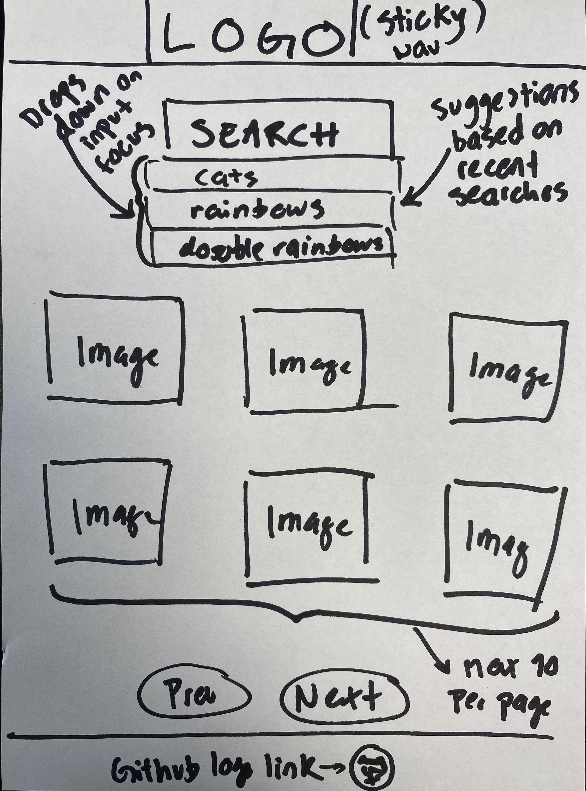

# Salt React Gallery - Day 1 - Building the MVP

## A. Scenario

A minimum viable product (MVP) is a version of a product with just enough features to satisfy early customers and provide feedback for future product development.

## B. MVP specifications

### Tech stack specifications

The project _must_:

* Be created with `create-react-app`.
* Use original layout work, no Bootstrap or similar allowed.
* Be responsive, with mobile first in mind.
* Be tested up using Jest as a testrunner, and utilize React Testing Library.
  * At the end of the day at least one test with snapshot testing.
* Have only _one_ `index.html` (our 'Single Page') and then use ReactJS as frontend framework.
* Have _multiple_ React components and any imports from one file to another should be made using ES6 import/export syntax (e.g. `import fetcher from './fetcher'`).
  * The components should be written in functional style.

The project shall also:

* Have all of its JavaScript and CSS bundled with webpack.
  * Your choose method of styling yourself, be it SCSS, styled components or otherwise.
* This goes without saying, but should look good in a professional kind of style.

### MVP requirements

We want you to build an application similar to the following 'design'.

The technical requirements are fairly few, so feel free to add features if you have time. However, we require that the application:

1. Has a form which, on submit, fetches images from the [Unsplash API /search/photos endpoint](https://unsplash.com/documentation#search-photos). You'll have to set up a developer account and get an API key for making your requests.

2. When the form is selected, a 'suggestions' list should be appended to it. The suggestions list should be based on any previous searches. We want you to do this by saving the previous searches in [Window.localStorage](https://developer.mozilla.org/en-US/docs/Web/API/Window/localStorage) (which is like a database in the browser). Remember that the view should be based on the state, not the other way around.

3. When you get a response from the Unsplash API, render the 10 images as cards on the web page.

4. Every card should have a flip/rotate animation. On the backside of each card, list some text information from the Unsplash API response.

5. There should be a pagination functionality so that when clicking the `next` button, the 10 next images should be displayed. There should also be a `previous` button which fetches the previous 10 images.

6. You should have written tests.

---

GLHF!
# image-gallery
